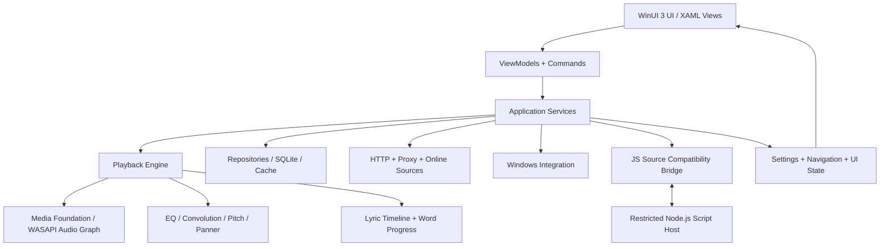
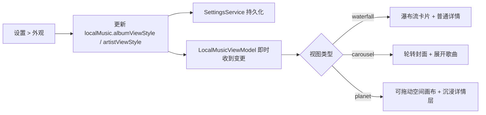

# LX Music Desktop → WinUI 3 完整迁移总纲

> 文档性质：后续迁移工作的架构基线、范围合同、实现顺序与验收依据  
> 原项目基线：仓库中的 `src/**` 及其直接依赖配置  
> 目标平台：Windows 10 1809+ / Windows 11，WinUI 3 + Windows App SDK  
> 当前决策：桌面歌词延期；主窗口优先使用 Windows 原生标题栏按钮；JS 音源脚本必须保持协议级兼容  
> 重要说明：本文只制定迁移方法和验收标准，不认可任何现有原生毛坯为“已迁移完成”。

## 1. 迁移目标

本次工作不是制作一个外形近似的 WinUI 3 演示程序，而是将原应用的功能、状态、交互、数据和视觉语言完整迁移到 Windows 原生桌面应用，同时显著降低常驻内存并保留用户现有数据。

最终版本必须满足以下四项条件：

1. **功能等价**：除本文明确延期的桌面歌词外，原应用所有用户可达功能均有可用实现。
2. **交互等价**：按钮不能只是绘制；点击、悬停、右键、拖动、键盘、返回、取消、错误和加载状态都必须对应原逻辑。
3. **视觉等价**：以原版实际运行截图和组件状态为基准，保留侧栏、顶栏、卡片、玻璃、浮岛、详情页、沉浸模式和主题系统的视觉关系。
4. **数据与协议兼容**：设置、歌单、缓存、历史数据和 JS 音源脚本不能因更换技术栈而失效。

不允许用以下做法代替迁移：

- 用静态假数据填充页面后标记功能完成；
- 只创建 XAML 外观但不连接 Command、状态和服务；
- 将多个原模块压成一个页面而丢失路由、弹窗或上下文操作；
- 为赶进度删除不熟悉的设置项、异常分支或后台协议；
- 以“WinUI 3 没有同名控件”为理由省略行为；
- 未建立兼容测试就重写 JS 音源协议。

## 2. 已确定的范围边界

### 2.1 首个完整可验收版本必须包含

- 主窗口壳层、侧栏、顶栏、所有主路由和返回关系；
- 搜索、榜单、在线歌单、我的歌单、本地音乐、下载管理；
- 完整播放队列和播放控制；
- 底部浮岛及展开/紧凑状态；
- 浮岛到播放器详情页的连续过渡；
- 播放器详情页、逐字歌词、评论、队列入口；
- 沉浸模式、背景、动效、可视化、音源/歌词源选择和声音面板；
- 设置页中除桌面歌词实际窗口外的所有功能；
- 主题编辑、云母/云母 Alt/亚克力/纯色材质选项；
- 本地专辑和歌手的瀑布流、轮转、行星视图；
- 用户 JS 音源脚本导入、运行、请求、取消、切换、更新提醒和代理；
- 同步、OpenAPI、快捷键、托盘、更新、备份恢复和数据迁移；
- 原版需要的 Bilibili、网络、数据库、缓存、媒体会话和系统集成。

### 2.2 明确延期但不能从架构中删除

桌面歌词暂不进入首个验收版本，包括：

- `src/renderer-lyric/**`；
- `src/main/modules/winLyric/**`；
- 独立歌词窗口的创建、锁定、穿透、置顶和屏幕位置管理；
- 桌面歌词实际渲染与多屏行为。

延期规则：

- `desktopLyric.*` 设置字段仍需保留并可被数据迁移层读取，不能清洗掉；
- IPC/服务接口需要保留命名空间或兼容占位，但首版 UI 应明确显示“暂未迁移”，不能提供无效开关；
- 播放器内部歌词、状态栏歌词和沉浸歌词不属于延期范围；
- 后续实现桌面歌词时不得要求重新设计播放器或歌词数据模型。

### 2.3 窗口右上角按钮

WinUI 3 版本默认使用 Windows 原生最小化、最大化/还原、关闭按钮。无需强制复刻红黄绿圆点，但必须保留窗口行为：

- 最小化；
- 最大化与还原状态同步；
- 关闭时根据托盘设置决定隐藏或退出；
- 可拖动标题栏区域；
- 双击标题栏最大化/还原；
- 全屏进入与退出；
- Windows 11 Snap Layout 兼容；
- 键盘和系统菜单行为不被破坏。

只有在自定义标题栏不会破坏 Snap、DPI、可访问性和系统菜单时，才允许进一步定制视觉。

## 3. 不能机械逐行翻译，但必须逐文件结案

Vue/Electron 文件不能简单一对一翻成 XAML/C#：组件生命周期、CSS 布局、Web Audio、Web Worker、Electron IPC 和 WinUI 3 的对象模型不同。正确方法是以原文件为证据，以“行为合同”为迁移单位，再让每个原文件在迁移台账中有明确归宿。

每个 `src/**` 文件必须在迁移台账中标记为以下一种，禁止空白：

| 状态 | 含义 | 允许条件 |
|---|---|---|
| `Native` | 已在 C#/XAML/C++/WinRT 中等价实现 | 有目标文件、测试和验收记录 |
| `Host` | 保留在受控 Node.js 兼容宿主中 | 仅用于 JS 音源等必须保持 JS 语义的模块 |
| `Asset` | 作为图片、字体、主题或许可证资源复用 | 已核对打包和许可证 |
| `Generated` | 由构建生成，不手工移植 | 生成来源和目标产物明确 |
| `Deferred` | 经范围决策延期 | 当前只允许桌面歌词相关文件 |
| `Obsolete` | 目标平台确实不再需要 | 必须写明替代机制，经过人工批准 |

台账至少包含：

```text
source_path,target_path,status,owner,behavior_contract,test_case,visual_baseline,notes
```

实施阶段必须增加覆盖检查：`src/**` 新增、删除或重命名文件后，台账覆盖率不是 100% 时构建失败。这样保证“每个文件都复刻/结案”，而不是依赖人工记忆。

## 4. 原项目规模与真值来源

当前 `src` 约 917 个文件，主要分布如下：

| 区域 | 文件数（审计时） | 迁移意义 |
|---|---:|---|
| `src/common` | 78 | 类型、默认设置、主题、常量、迁移逻辑、IPC 合同 |
| `src/lang` | 8 | 多语言资源和语言注册 |
| `src/main` | 150 | Electron 主进程、数据库、窗口、同步、脚本宿主、系统能力 |
| `src/renderer` | 625 | 主界面、业务状态、播放器、页面、组件、供应商代码 |
| `src/renderer-lyric` | 34 | 桌面歌词，首版延期 |
| `src/static` | 22 | 静态图片 |

优先级从高到低的真值来源：

1. 原应用实际运行行为和用户数据；
2. `src/common/types/**`、`defaultSetting.ts`、IPC 类型与事件名；
3. `src/renderer/core/**`、`store/**`、`src/main/**` 的状态与业务实现；
4. Vue 模板、LESS/CSS、图标和运行截图；
5. 注释和文档；
6. 当前 `native/**` 毛坯只可作为参考，不可反向覆盖原版行为。

## 5. 目标架构



### 5.1 推荐解决方案分层

```text
native/
  LXMusic.App/                 WinUI 3 启动、窗口、页面和资源
  LXMusic.Presentation/        ViewModel、导航、交互状态、UI 服务
  LXMusic.Core/                领域模型、播放队列、歌词、歌单、规则
  LXMusic.Infrastructure/      SQLite、文件、网络、缓存、设置迁移
  LXMusic.Audio/               播放、媒体会话、DSP、可视化采样
  LXMusic.SourceHost/          C# 侧脚本桥、协议验证、宿主管理
  source-host/                 Node.js 受限脚本运行时
  LXMusic.Tests/               单元、协议、集成和迁移测试
  LXMusic.UI.Tests/            WinAppDriver/UI Automation 测试
```

原则：View 不直接访问数据库、网络或脚本；任何可点击元素都绑定 Command；所有长任务可取消；播放器是全局单实例状态机，不跟随页面销毁。

## 6. 原目录到目标模块的总映射

### 6.1 `src/common/**`

| 原文件/目录 | 目标 | 必须保留 |
|---|---|---|
| `config.ts`、`constants*.ts` | `LXMusic.Core/Constants` | 平台常量、同步常量、限制值 |
| `defaultSetting.ts` | `SettingsDefaults.cs` | 全部字段、默认值、平台差异 |
| `defaultHotKey.ts`、`hotKey.ts` | `HotKeyDefaults/Models` | 快捷键结构、冲突与启用状态 |
| `ipcNames.ts`、`mainIpc.ts`、`rendererIpc.ts` | `Contracts` | 作为兼容合同转成强类型消息/服务 |
| `theme/**` | `ThemeCatalog + ResourceDictionary` | 内置主题、颜色变量、主题 ID |
| `types/**` | C# record/enum/interface | 所有设置、音乐、列表、下载、同步类型 |
| `utils/**` | Core/Infrastructure utilities | 迁移、格式化、哈希、歌词、列表等语义 |

`src/common/utils/migrateSetting.ts` 必须被视为数据升级历史，不能只读取当前默认设置。原用户跨版本升级时的旧字段映射要转成有版本号、可重复执行的迁移步骤。

### 6.2 `src/lang/**`

- JSON 语言键迁移到 `.resw` 或保持 JSON 并由本地化服务读取；
- 保留 `zh-cn`、`zh-tw`、`en-us`；
- 未翻译键的回退规则与原版一致；
- UI 自动化需检查切换语言后菜单、设置页、弹窗和播放器文本即时更新；
- 禁止把当前中文硬编码当作最终实现。

### 6.3 `src/main/**`

| 原模块 | WinUI 3 对应服务 | 关键行为 |
|---|---|---|
| `app.ts`、`index.ts` | App bootstrap | 单实例、协议、启动参数、异常恢复 |
| `event/**` | Event broker | 生命周期、跨模块广播、解除订阅 |
| `modules/winMain/**` | WindowService | 窗口、对话框、缓存、更新、媒体按钮 |
| `modules/tray.ts` | TrayService | 托盘菜单、隐藏/恢复、退出语义 |
| `modules/hotKey/**` | GlobalHotKeyService | 注册、冲突提示、配置更新 |
| `modules/sync/**` | SyncService | 客户端/服务端、鉴权、快照、设备管理 |
| `modules/openApi/**` | OpenApiService | 端口、局域网绑定、动作分发 |
| `modules/bili/**` | BiliService | 登录 Cookie、搜索、URL、MV、歌词、评论 |
| `modules/userApi/**` | SourceHostService + Node host | JS 音源完整兼容，见第 15 节 |
| `modules/winLyric/**` | DesktopLyricService | 首版延期但保留接口 |
| `worker/**` | BackgroundTask/Worker | 数据处理不阻塞 UI 线程 |
| `utils/**` | Infrastructure | 存储、日志、网络和路径 |

### 6.4 `src/renderer/**`

| 原目录 | 目标 | 迁移策略 |
|---|---|---|
| `App.vue` | `ShellPage.xaml` | 复刻全局层级，不将浮岛塞入单页 |
| `router.ts` | NavigationService | 路由、查询参数、返回栈和激活态 |
| `assets/**` | Assets/Styles | 图标、全局样式、材质变量 |
| `components/base/**` | Controls | 统一按钮、弹窗、菜单、列表、滑块等 |
| `components/common/**` | Reusable Controls | 音乐列表、选择、下载、歌词等 |
| `components/layout/**` | Shell Controls | 侧栏、顶栏、浮岛、详情、全局弹窗 |
| `core/**` | Application/Core Services | 业务状态、播放器、数据初始化、同步 |
| `event/**` | EventAggregator | 强类型事件和生命周期 |
| `plugins/**` | UI Services | Dialog、Toast、i18n、ContextMenu 等 |
| `store/**` | State/ViewModels | 全局、播放、设置、列表、下载状态 |
| `utils/**` | Utilities/Adapters | IPC 改服务调用；组合函数改可测试类 |
| `vendor/**` | Native port 或受控复用 | 每个供应商文件需有许可证和迁移结论 |
| `views/**` | Pages | 逐页面复刻并连接真实业务 |
| `worker/**` | BackgroundTask | 可取消后台任务 |

### 6.5 `src/static/**`

- 图片像素、透明通道和缩放模式需核对；
- SVG 优先转 WinUI Geometry 或保留为可打包资源；
- 为 100%、125%、150%、200% DPI 验证清晰度；
- 许可证和署名文件随安装包保留。

## 7. 应用壳层与导航

### 7.1 原版层级

`App.vue` 的主要层级必须保留：侧栏、顶栏、页面舞台、浮岛、全局图标、更新/协议/同步弹窗和播放器详情覆盖层。播放器浮岛与详情页属于应用壳，不属于任一业务页面。

### 7.2 主路由

| 原路由 | 页面 | 必须验证的导航行为 |
|---|---|---|
| `/search` | 搜索 | 顶栏聚焦、来源/歌曲歌单切换、历史与热搜 |
| `/songList/list` | 在线歌单 | 来源、标签、排序、歌曲/歌单切换 |
| `/songList/detail` | 歌单详情 | 返回、加载、播放全部、收藏/导入 |
| `/leaderboard` | 排行榜 | 榜单切换、列表刷新、播放和菜单 |
| `/list` | 我的歌单 | 列表管理、排序、搜索、批量操作 |
| `/local` | 本地音乐 | 曲目/专辑/歌手、三种视图、空间交互 |
| `/local/detail` | 本地详情 | 专辑/歌手上下文、返回与滚动定位 |
| `/download` | 下载 | 任务状态、重试、暂停、移除、已下载 |
| `/setting` | 设置 | 18 个分区、查询参数兼容、滚动复位 |

NavigationService 必须支持：

- 路由参数等价模型；
- 页面前进/后退栈；
- 从浮岛标题跳回歌曲所属列表并定位歌曲；
- 从设置旧入口 `SettingPlayDetail` 跳到 `SettingAppearance`；
- 侧栏折叠前后激活标记位置连续；
- 页面销毁不影响播放器；
- 全屏详情覆盖时保留底层页面状态。

## 8. 视觉系统与玻璃材质

### 8.1 视觉复刻方法

每个页面至少建立以下基线截图：

- 浅色/深色；
- 100% 与 150% DPI；
- 1280×720、1600×900、1920×1080；
- 空数据、加载、正常、错误；
- 鼠标悬停、按下、聚焦、选中；
- 浮岛紧凑/展开、详情页、沉浸模式；
- 动画开启与“减少动态效果”。

视觉验收不仅比较颜色，还包括布局边界、字号、字重、圆角、阴影、模糊、层级、滚动条、裁剪和动效路径。

### 8.2 材质设置

外观设置增加以下主窗口材质：

| 选项 | WinUI 实现 | 适用说明 |
|---|---|---|
| 跟随系统/推荐 | 自动选择 | Windows 11 默认 Mica；不支持时纯色回退 |
| 纯色 | 无 SystemBackdrop | 性能和兼容优先 |
| 云母 Mica | `MicaBackdrop(Base)` | 主窗口长寿命底层 |
| 云母 Alt | `MicaBackdrop(BaseAlt)` | 层级更明显的窗口背景 |
| 亚克力 Acrylic | `DesktopAcrylicBackdrop` | 需要更明显透视的外观 |

原应用中具有玻璃语义的区域都要读取同一套材质策略，但不能误认为 SystemBackdrop 会自动覆盖内部控件。侧栏、顶栏搜索框、内容卡片、底部浮岛、弹窗和详情控制面板需要各自的半透明 Brush、Tint、Luminosity、Border 和 Shadow token。

必须处理：

- 系统不支持、节能模式、远程桌面、高对比度时回退；
- 窗口失焦时材质变化；
- 深浅主题的 tint 与文字对比度；
- 亚克力区域不能层层叠加导致浑浊；
- 材质切换即时生效并持久化；
- 浮岛和详情过渡过程中材质连续，不闪成纯白/纯黑。

### 8.3 主题

- 保留 `theme.id`、`theme.lightId`、`theme.darkId`；
- 内置主题、跟随系统、日夜切换和自定义主题均需迁移；
- `ThemeSelectorModal` 的选择、预览、删除和应用不能省略；
- `ThemeEditModal/**` 中主色、字体色、应用/主区域背景、侧栏文字、徽标三级色、窗口按钮色等每个编辑器都要落到 WinUI ResourceDictionary；
- 动态切换后已打开页面、弹窗、浮岛和详情页必须同时更新。

## 9. 侧栏、顶栏和全局层

### 9.1 侧栏

原文件：`Aside/index.vue`、`NavBar.vue`、`NowPlayingList.vue`、`ControlBtns.vue`。

必须实现：

- 80/196 两档宽度和折叠动画；
- Logo/品牌区点击行为；
- 发现、在线歌单、下载、本地曲目/专辑/歌手、我的歌单等入口；
- 路由和查询参数共同决定激活项；
- 激活/悬停玻璃胶囊连续移动；
- 当前播放列表封面纵向队列、活动项和点击跳转；
- 长列表虚拟化，不因封面数量增加持续抬高内存；
- 键盘导航、ToolTip 和屏幕阅读器名称。

### 9.2 顶栏

原文件：`Toolbar/index.vue`、`SearchInput.vue`、`SunMoonToggle.vue`、`ControlBtns.vue`。

必须实现：

- 搜索框焦点、回车、清空、历史联动；
- 当前歌词/曲目信息居中显示；
- 日夜主题切换；
- 设置入口；
- 原生标题栏按钮与拖动区域不冲突；
- 页面滚动时顶栏层级和玻璃效果稳定。

### 9.3 全局弹层

`ChangeLogModal`、`PactModal`、`UpdateModal`、同步认证/模式弹窗、通用 Dialog/Toast/ContextMenu 都属于首版。每个弹层都要验证焦点圈定、Esc、Enter、取消、遮罩点击、后台任务和窗口缩放。

## 10. 页面模块与交互合同

### 10.1 搜索

- 音源标签与聚合搜索；
- 歌曲/歌单结果切换；
- 热门搜索和历史搜索的显示开关；
- 历史删除、点击回填、重复项处理；
- 请求取消、防抖、分页、空白页和错误重试；
- 歌曲播放、右键菜单、加入列表、下载、收藏/不喜欢；
- 歌单卡片进入详情并正确返回。

对应文件组：`views/Search/**`、搜索相关 `components/common/**`、`core/music/online.ts`、`utils/musicSdk/**`。

### 10.2 在线歌单与详情

- 来源、标签、排序、最新/最热；
- 卡片图片懒加载和复用；
- 打开歌单、歌单来源切换；
- 详情加载、失败重试、播放全部；
- 列表菜单、下载、加入我的歌单；
- 返回后恢复列表位置和筛选条件。

对应文件组：`views/songList/List/**`、`views/songList/Detail/**`。

### 10.3 排行榜

- 左侧榜单列表、活动榜单；
- 榜单歌曲加载和来源切换；
- 播放、菜单、加载与错误态；
- 榜单切换取消旧请求，避免结果串页。

对应文件组：`views/Leaderboard/**`。

### 10.4 我的歌单

- 新建、重命名、删除、拖动排序；
- 歌单更新、重复歌曲检测、分享；
- 歌曲搜索、排序、切换、批量移动/删除；
- 列表和歌曲滚动位置恢复；
- 单击播放策略读取 `list.isClickPlayList`；
- 操作按钮显示策略、来源列、添加位置等设置即时生效。

对应文件组：`views/List/MyList/**`、`views/List/MusicList/**` 和数据库 list 模块。

### 10.5 下载管理

- 等待、下载中、暂停/失败、完成状态；
- 并发上限、重复文件、重试、移除和清空；
- 保存目录、文件命名、歌单分组；
- 歌词格式、封面和歌词标签嵌入；
- 使用其他来源的回退逻辑；
- 应用重启后任务恢复和磁盘异常处理。

对应文件组：`views/Download/**`、`core/music/download.ts`、下载数据库和主进程事件。

## 11. 本地音乐与行星视图

原文件：`views/LocalMusic/index.vue`、`Detail.vue`、`spatialCanvas.ts` 以及本地音乐扫描/缓存服务。

### 11.1 基础行为

- 扫描一个或多个目录；
- 增量刷新、删除失效记录、读取元数据和封面；
- 曲目、专辑、歌手三种分组；
- 搜索、排序、播放、右键菜单和定位文件；
- 封面缓存、缺图占位、损坏文件容错；
- 大音乐库使用虚拟化和分页/增量加载。

### 11.2 外观设置到页面的状态链



选项及原语义：

- 专辑：`waterfall | carousel | planet`，默认 `carousel`；
- 歌手：`waterfall | carousel | planet`，默认 `waterfall`。

改变设置后不得要求重启。切换视图时需妥善结束旧视图的动画、ResizeObserver 等价监听、惯性和选中状态。

### 11.3 行星视图交互

- 专辑/歌手分布由 `spatialCanvas.ts` 的空间布局语义迁移；
- 支持指针拖拽、边界/回弹、点击与拖拽判定；
- 卡片具有深度、缩放、透明度、层级和光晕；
- Resize/DPI 改变重新计算空间但不跳到无关位置；
- 点击专辑时记录卡片在窗口中的几何原点；
- 行星详情从原卡片位置扩展为覆盖层，显示封面、元信息和歌曲行星簇；
- 点击背景、返回或 Esc 反向收拢到来源位置；
- 关闭动画期间锁定重复点击；
- “减少动态效果”下改为短淡入淡出，但功能和层级不变；
- 触摸板、鼠标、触屏和键盘至少有一套可达操作；
- 10,000+ 曲目场景不得为每项创建常驻重型视觉对象。

### 11.4 普通详情

`Detail.vue` 的专辑/歌手封面、元数据、播放第一首、返回、歌曲列表、缓存封面和路由上下文都需保留。三种视图可以共享详情 ViewModel，但不得强迫所有视图使用同一种视觉交互。

## 12. 播放器核心

播放器迁移优先于页面美化，因为浮岛、详情、沉浸模式、下载和媒体会话都依赖它。

### 12.1 全局状态机

至少包含：

```text
Empty → ResolvingSource → Loading → Playing ↔ Paused
                          ↘ Buffering ↗
                          ↘ Error → Retry/Skip/Stop
Playing → Ended → Next/Stop
Any → Disposed
```

状态必须包含当前曲目、队列、队列索引、播放模式、实际/目标音质、URL 生命周期、进度、缓冲、音量、静音、速率、设备、错误、歌词和封面。

### 12.2 播放行为

- 顺序、列表循环、单曲循环、随机等原模式；
- 上一首、下一首、播放/暂停、跳转进度；
- 自动播放、结束停止、定时停止、错误自动跳过；
- URL 过期、来源失败、备用源、429 限流；
- 保存播放时间、预加载下一首；
- 切换输出设备、设备移除策略；
- 音量、静音、播放速率和保持音高；
- Windows SMTC 媒体信息、耳机/键盘媒体键、任务栏进度；
- 电源保持策略只在必要状态开启。

### 12.3 音效

原 `useSoundEffect` 及面板能力必须对应：

- 10 段均衡器与预设；
- 卷积混响文件、主增益和发送增益；
- Pitch Shifter；
- Panner/旋转声场；
- 最大输出声道；
- 效果实时变更、复位、保存预设；
- 不支持的设备明确降级，不静默假装启用。

## 13. 底部浮岛

原文件：`PlayBar/index.vue`、`FloatingIsland.vue`、各进度条组件和控制组件。

### 13.1 展开态

必须连接真实状态：

- 封面、标题、歌手/专辑、来源和时长；
- 上一首、播放/暂停、下一首；
- 喜爱/加入列表、下载；
- 播放模式；
- 打开播放队列；
- 音量、静音与滑块；
- 进度拖动、当前时间和总时长；
- 紧凑/展开切换；
- 右键封面或点击标题返回歌曲所在列表并定位。

### 13.2 紧凑态

- 紧凑状态写入 UI 状态并在重启后按原行为恢复；
- 播放且允许动画时封面旋转；
- 控件减少但核心播放操作仍可达；
- Hover/Focus 可揭示必要信息；
- 浮岛大小变化不能挤压主页面布局。

### 13.3 资源与内存

- 封面解码按实际显示尺寸；
- 曲目切换后释放旧 Bitmap、动画和颜色分析资源；
- 浮岛永久存在但不得永久持有历史歌曲对象；
- 波形/可视化未显示时停止采样和绘制。

## 14. 浮岛 → 播放器详情 → 沉浸模式

### 14.1 连续过渡合同

点击浮岛封面时，原版先调用 `capturePlayDetailOrigin(playerRef)`，记录：

- 浮岛矩形；
- 封面矩形；
- 壳体与封面圆角；
- 封面当前 transform；
- 封面图片；
- 背景、边框、阴影、backdrop-filter 视觉状态；
- 快照时间，约 1200ms 后失效。

WinUI 3 实现必须采用 ConnectedAnimation、Composition Visual 或等价自定义过渡，不能直接隐藏浮岛再淡入一个无关页面。

原时间基准：

| 项目 | 原值 |
|---|---:|
| 壳体展开 | 620ms |
| 内容进入 | 360ms |
| 内容延迟 | 28ms |
| 浮岛重新揭示延迟 | 440ms |

缓动以原 `cubic-bezier` 为准。退出时反向连接到当前浮岛位置；窗口已缩放或快照失效时重新读取实时位置。

### 14.2 播放器详情页

对应 `components/layout/PlayDetail/**`，必须包含：

- 经典和其他 `layoutStyle`；
- `aura`、`blur` 等详情背景及封面动态取色；
- 大封面、逐行/逐字歌词、翻译、罗马音；
- 歌词字号、对齐、激活缩放、延迟滚动和进度设置；
- 详情专用播放栏、评论、队列按钮；
- 封面点击/返回关闭详情；
- 自动隐藏鼠标与控制栏；
- 全屏和窗口状态；
- 加载、无歌词、歌词错误、封面错误。

### 14.3 沉浸模式

`ImmersiveLyrics.vue`、三个面板和 Folia 视觉模块不能被压缩成一张静态歌词页。

必须实现：

- 当前/上一行/下一行歌词及逐字时间进度；
- 翻译、罗马音、简繁转换和互换顺序；
- Esc 分层退出：先关面板，再退沉浸/详情；
- 鼠标静止后按 `immersiveControlHideDelay` 隐藏控件；
- 背景：Aura、模糊封面、MV；
- MV 播放与音频位置同步，原实现约每 800ms 校准；
- MV 来源 `auto/current/bili`；
- 歌词来源 `auto/current/bili/netease/lrclib`；
- 搜索候选、选择候选、重试和来源失败提示；
- 音量和音效面板；
- 音频可视化开关、高度和 `wave/bars/ambient`；
- 动效系列：`classic`、`cadenza`、`partita`、`fume`、`cappella`、`tilt`、`claddagh`、`diorama`、`monet`、`pendolo`；
- 每种 Folia 效果及其背景实现都在文件台账中逐项结案；
- 减少动态效果、低性能设备和窗口失焦时降级。

## 15. JS 音源脚本兼容层（最高风险）

### 15.1 结论

不建议把用户脚本改写成 C#，也不建议在 WinUI WebView 中开放不受控 Node 能力。应保留一个最小 Node.js 兼容宿主，在独立低权限进程中重建原 `globalThis.lx` 协议，WinUI 主进程通过版本化 JSON-RPC 与之通信。

推荐生命周期：未选择用户脚本时不启动 Node；选择后启动一个受限宿主；切回内置源立即取消请求并退出宿主。这样兼顾脚本兼容与空闲内存。

### 15.2 必须逐项覆盖的原文件

- `src/main/modules/userApi/index.ts`
- `src/main/modules/userApi/main.ts`
- `src/main/modules/userApi/utils.ts`
- `src/main/modules/userApi/config/index.ts`
- `src/main/modules/userApi/renderer/preload.js`
- `src/main/modules/userApi/renderer/user-api.html`
- `src/main/modules/userApi/rendererEvent/name.js`
- `src/main/modules/userApi/rendererEvent/rendererEvent.ts`
- `src/renderer/core/apiSource.ts`
- `src/renderer/core/useApp/useInitUserApi.ts`
- `src/renderer/utils/ipc.ts` 中全部 userApi 调用
- `views/Setting/components/UserApiModal.vue`
- `views/Setting/components/UserApiOnlineImportModal.vue`
- `utils/musicSdk/**` 及音乐 URL、歌词、封面、备用源调用链

### 15.3 导入与存储兼容

- 解析脚本开头的块注释元数据；
- 限制：`@name` 24、description 36、author 56、homepage 1024、version 36；
- ID 格式保持 `user_api_<3位随机数>_<时间戳>`；
- `allowShowUpdateAlert` 默认 `true`；
- UI 列表上限 20；
- 兼容原存储格式：`gz_` + deflate 后 Base64；
- 在线导入只允许 HTTP(S)，最多跟随 3 次重定向，脚本上限 9,000,000 字节；
- 导入前显示元数据与风险提示；
- 删除活动脚本时先取消请求并切换到可用内置源；
- 导入/替换失败不能损坏原脚本记录。

### 15.4 `lx` 全局协议

宿主必须暴露与原版相同的核心能力：

```text
lx.version = "2.0.0"
lx.env = "desktop"
lx.EVENT_NAMES.request
lx.EVENT_NAMES.inited
lx.EVENT_NAMES.updateAlert
lx.request(...)
lx.send(...)
lx.on(...)
lx.utils.crypto.*
lx.utils.buffer.*
lx.utils.zlib.*
lx.currentScriptInfo
```

具体语义：

- `lx.request` 支持 method、headers、body、form、formData、代理、回调；
- timeout 最大 60 秒；
- 返回取消函数；
- 响应保留状态码、状态文本、headers、bytes、raw、body；
- body 能解析 JSON 时转换，否则保持字符串；
- `inited` 只能调用一次；
- `updateAlert` 每次脚本生命周期只能调用一次；
- `on(request, handler)` 注册脚本请求处理器；
- 未处理 Promise rejection 和脚本加载错误在初始化前上报，消息截断到兼容长度；
- `currentScriptInfo` 包含 name、description、version、author、homepage、rawScript。

工具函数必须包含：

- AES `createCipheriv` 等价行为；
- RSA `RSA_NO_PADDING`，并保持原 128 字节左填充语义；
- `randomBytes`、MD5；
- Buffer `from`、二进制转字符串；
- zlib inflate/deflate Promise 行为。

### 15.5 来源、动作与结果验证

- 来源：`kw`、`kg`、`tx`、`wy`、`mg`、`local`；动作兼容表中保留 `xm`；
- 音质：`128k`、`320k`、`flac`、`flac24bit`；
- 动作：`musicUrl`、`lyric`、`pic`，按各来源白名单裁剪；
- `local` 的 URL/歌词/封面能力按原协议开放；
- URL/图片必须为 HTTP(S) 字符串且不超过 2048；
- 歌词对象：主歌词不超过 51200，翻译/罗马音小于 5120，LxLyric 小于 8192；
- 非法响应必须拒绝并返回可诊断错误，不能让坏数据进入播放器。

### 15.6 请求并发、取消与切源

- 请求表以 `requestKey` 为键；
- 单请求 20 秒业务超时；
- 相同 key 新请求先取消旧请求；
- UI 取消向宿主发送 cancel，Promise 以 `Cancel request` 等价错误结束；
- 切换 `common.apiSource` 时所有进行中的脚本请求以 `source changed` 结束；
- 请求完成、失败、超时、宿主退出都必须清理计时器和表项；
- 宿主崩溃后状态改为失败，允许重启，不无限自动拉起；
- 状态广播包含脚本信息、来源、动作和音质列表；
- 切换失败回退到第一个可用内置源并持久化；
- 避免重复选择同一脚本导致重复初始化。

### 15.7 URL、歌词和封面解析链

完整调用次序需保留：

1. 等待当前 API 初始化闸门；
2. 检查本地有效缓存；
3. 根据歌曲来源和目标音质调用内置 SDK 或用户脚本；
4. 当前来源失败时按设置查询其他来源匹配；
5. 按候选源重试，并保留 Bilibili 特殊规则；
6. 遇到 `tooManyRequests` 等限流条件按原逻辑短路；
7. 成功后写入带生命周期的 URL/歌词/封面缓存；
8. 取消、切歌、切源时停止后续回写，防止旧结果污染新曲目。

### 15.8 宿主安全边界

- 宿主独立进程、Job Object 绑定主应用，主应用退出时强制回收；
- 使用命名管道或 stdin/stdout JSON-RPC，不开放随机 TCP 端口；
- 消息有长度上限、schema 校验、requestId 和协议版本；
- 禁止脚本直接访问 C# 对象、数据库和 UI；
- 文件系统、子进程、动态原生模块默认不可用；
- 网络只能通过 `lx.request`，统一代理、超时、取消和 User-Agent；
- 仅将协议所需 crypto/buffer/zlib 能力暴露给脚本；
- 在线导入不等于自动启用；
- 日志脱敏 Cookie、Authorization 和用户路径；
- 宿主关闭时清空临时状态和凭据。

### 15.9 脚本兼容验收套件

至少准备以下固定脚本：

1. 正常初始化并返回 URL；
2. 四种音质和多个来源；
3. 歌词含翻译、罗马音、LxLyric；
4. 图片获取；
5. HTTP GET/POST、JSON、form、formData；
6. 代理；
7. AES、RSA、MD5、Buffer、zlib；
8. 取消、20 秒超时、60 秒网络超时上限；
9. 重复 requestKey；
10. 切源中断；
11. 非法 URL、超长歌词和错误对象；
12. 初始化异常和未处理 rejection；
13. 更新提醒仅一次及禁止提醒设置；
14. 宿主崩溃和恢复；
15. 原 `gz_` 存储数据升级。

同一脚本在 Electron 原版和 WinUI 3 宿主运行，比较事件顺序、输出、错误类型、取消时机和网络请求，形成 golden fixtures。此套件未通过前，用户脚本功能不得标记完成。

## 16. 设置系统完整迁移

`views/Setting/index.vue` 包含 18 个分区。除桌面歌词实际功能延期外，其余均必须连接真实服务。

| 分区 | 原组件 | 迁移要点 |
|---|---|---|
| 基本 | `SettingBasic` | 语言、字体、字号、窗口、动画、更新、托盘等 |
| 外观 | `SettingAppearance` | 基本外观、专辑/歌手视图、详情/沉浸设置、材质 |
| 播放 | `SettingPlay` | 音质、模式、音量、歌词、设备、音效、错误策略 |
| 桌面歌词 | `SettingDesktopLyric` | 首版标记延期，字段保留 |
| 搜索 | `SettingSearch` | 热搜、历史、焦点 |
| 列表 | `SettingList` | 点击播放、来源列、滚动、添加位置、操作按钮 |
| 账号 | `SettingAccount` | Bili/WY/TX/KG Cookie、登录态与清除 |
| 本地音乐库 | `SettingLocalMusicLibrary` | 目录、扫描、刷新、缓存 |
| 下载 | `SettingDownload` | 路径、并发、命名、歌词/封面嵌入、备用源 |
| 快捷键 | `SettingHotKey` | 全局/应用快捷键、冲突、启用 |
| 同步 | `SettingSync/**` | 模式、服务端、客户端、设备、认证 |
| OpenAPI | `SettingOpenAPI` | 启用、端口、LAN、冲突 |
| 网络 | `SettingNetwork` | 代理启用、主机、端口、即时影响脚本宿主 |
| ODC | `SettingOdc` | 自动清空搜索输入/结果 |
| 备份 | `SettingBackup` | 导入导出、版本、覆盖确认、回滚 |
| 其他 | `SettingOther` | 不喜欢列表、缓存、杂项行为 |
| 更新 | `SettingUpdate` | 检查、下载、进度、错误、重启更新 |
| 关于 | `SettingAbout` | 版本、许可证、链接和署名 |

配套弹窗不可遗漏：`DislikeListModal`、`PlayTimeoutModal`、`ThemeSelectorModal`、`ThemeEditModal/**`、`UserApiModal`、`UserApiOnlineImportModal`、`ServerDeviceListModal`。

### 16.1 设置字段兼容

`defaultSetting.ts` 中全部字段必须进入强类型模型，不能只迁移当前 UI 用到的部分。分组包括：

- `common.*`
- `account.*`
- `player.*` 及所有 `soundEffect.*`
- `playDetail.*`
- `desktopLyric.*`（保留但延期）
- `list.*`
- `localMusic.*`
- `download.*`
- `search.*`
- `network.proxy.*`
- `tray.*`
- `sync.*`
- `openAPI.*`
- `theme.*`
- `odc.*`

当前设置版本为 `2.1.0`。SettingsService 必须：

- 保存未知字段，避免新旧版本往返时丢失；
- 原子写入，崩溃后保留上一份有效副本；
- 按版本顺序执行迁移；
- 校验范围和枚举，非法值回退但记录日志；
- 提供变更通知，使页面即时响应；
- 敏感 Cookie 不写普通日志，优先使用 Credential Locker/DPAPI。

## 17. 数据、缓存和兼容迁移

必须审计并迁移数据库服务：

- 歌单与歌曲；
- 下载任务；
- 原始/编辑歌词；
- 音乐 URL 缓存；
- 其他来源匹配缓存；
- 不喜欢列表；
- 用户音源脚本；
- 主题、自定义预设、同步快照和 UI 状态。

迁移流程：

1. 只读检测旧数据位置和版本；
2. 创建可恢复备份；
3. 在临时目标库执行 schema/data 迁移；
4. 校验数量、主键、歌单顺序、关联和哈希；
5. 原子切换目标库；
6. 失败时回滚并保留诊断报告；
7. 首次成功后仍不删除旧数据，由用户确认后处理。

验收需使用小型、空库、大型库、损坏记录、重复记录和跨版本样本。

## 18. 后台与系统集成

### 18.1 同步

- 服务端/客户端模式；
- 端口、地址、认证码；
- 设备列表和移除；
- 快照数量、冲突、断线重连；
- 同步过程中 UI 状态和取消；
- 禁止在 UI 线程进行大数据序列化。

### 18.2 OpenAPI

- 启停、端口冲突、仅本机/局域网绑定；
- 动作权限和输入校验；
- 应用退出时释放监听；
- 设置变化安全重启服务。

### 18.3 托盘与快捷键

- 托盘图标、菜单、播放控制、显示/隐藏和退出；
- 关闭按钮行为与 `tray.enable` 一致；
- 全局快捷键注册状态、冲突提示、重新绑定；
- 媒体键不能触发双重命令。

### 18.4 更新

- 检查、无更新、有更新、下载进度、失败和重试；
- 用户取消与忽略；
- 安装前保存状态并安全停止脚本宿主、同步、OpenAPI 和播放器；
- 签名与下载完整性验证。

## 19. 性能与内存目标

更换技术栈的主要价值之一是减少 Chromium 常驻成本，但 WinUI 3 本身并不保证低内存，必须通过预算和分析工具约束。

### 19.1 测量规则

- 同一台机器、同一音乐库、同一曲目和同一运行时长；
- Release x64、无调试器；
- 启动后 5 分钟、播放 30 分钟、切换 50 页面、浏览大列表、运行用户脚本分别记录；
- 记录 Private Working Set、Commit、GC Heap、GPU Dedicated/Shared、句柄、线程、Bitmap 数和 Node 子进程；
- 与当前 Electron 原版同场景对照。

### 19.2 必须达到的趋势门槛

- 不使用用户脚本时 Node 宿主不运行；
- 空闲常驻内存目标不超过 Electron 同场景的 45%；
- 连续切页 50 次后内存回落，稳定值增长不超过 15%；
- 播放 30 分钟不持续累积封面、歌词、频谱缓冲或事件订阅；
- 大列表采用虚拟化，内存随可视项而非总项线性增长；
- 关闭详情/沉浸/MV 后停止对应 Composition、定时器、视频和音频采样；
- 图片解码尺寸匹配显示尺寸，缓存有数量和字节双上限；
- 脚本宿主退出后进程、管道和请求表全部释放。

绝对 MB 门槛需先用固定测试机测出 Electron 基线后写入验收配置，不能凭开发机单次任务管理器截图判断。

## 20. 测试体系

### 20.1 单元测试

- 设置默认值、迁移和序列化；
- 播放队列和各种模式；
- 歌词解析、逐字时间线、翻译/罗马音；
- 音源选择、质量和备用源；
- 文件名、下载和元数据；
- 行星空间布局和坐标变换；
- 主题 token；
- JS RPC schema、校验、取消和超时。

### 20.2 集成测试

- SQLite 升级与回滚；
- 网络代理、重定向和限流；
- 内置音源与用户脚本；
- 播放器 + SMTC + 输出设备；
- 同步、OpenAPI、托盘和快捷键；
- 更新生命周期。

### 20.3 UI 自动化

每个页面至少测试：打开、主要操作、右键菜单、返回、空态、错误态、键盘可达、DPI 改变。重点链路：

1. 搜索歌曲 → 播放 → 浮岛更新 → 打开详情 → 进入沉浸 → 返回；
2. 设置专辑视图为行星 → 本地专辑即时切换 → 拖动 → 打开/关闭详情；
3. 导入用户脚本 → 选择 → 播放 → 取消 → 切回内置源；
4. 新建歌单 → 加歌 → 排序 → 重启 → 数据仍在；
5. 添加下载 → 完成 → 文件和标签正确；
6. 材质 Mica/Acrylic/纯色切换 → 全壳层即时更新；
7. 托盘开启 → 关闭窗口隐藏 → 恢复 → 退出。

### 20.4 视觉回归

- 原版与 WinUI 3 使用同尺寸截图；
- 页面按区域比较，不让动态封面干扰主体；
- 建立布局误差阈值和人工复核；
- 动画用关键帧截图/录屏比对起点、中段、终点；
- 不允许用“整体看着差不多”代替检查。

## 21. 实施阶段与硬门禁

### 阶段 0：清点与合同冻结

产物：100% `src/**` 文件台账、路由表、设置表、IPC/事件表、数据库表、视觉基线、测试数据。

门禁：任何源文件未归类，不进入正式重写。

### 阶段 1：基础设施与数据兼容

实现 Core 类型、设置、日志、数据库、迁移、网络、代理、缓存、事件、依赖注入。

门禁：原用户数据只读迁移和回滚测试通过；全部设置字段可往返。

### 阶段 2：播放核心与音源

实现播放器状态机、内置来源、URL/歌词/封面、备用源、缓存、SMTC、音量和基础音效。

门禁：无 UI 或最小测试 UI 下完成连续播放、切歌、错误恢复和 30 分钟稳定性。

### 阶段 3：JS 音源兼容宿主

实现脚本存储、导入、`lx` 协议、RPC、隔离、取消、代理和更新提示。

门禁：第 15.9 节 golden 套件与 Electron 结果一致。

### 阶段 4：原生壳层与基础控件

建立资源 token、主题、玻璃材质、侧栏、顶栏、页面舞台、弹窗、菜单、列表控件。

门禁：浅/深、DPI、键盘、原生窗口行为和基线视觉通过。

### 阶段 5：业务页面

按依赖顺序实现我的歌单 → 本地音乐 → 搜索 → 在线歌单 → 榜单 → 下载 → 全设置页。

门禁：每个页面必须通过真实数据 E2E，不能以假数据验收。

### 阶段 6：浮岛、详情与沉浸

实现浮岛全交互、连接动画、详情、逐字歌词、MV、评论、声音/来源/样式面板和全部 Folia 效果。

门禁：打开/关闭连接动画、Esc 层级、自动隐藏、资源释放和视觉回归通过。

### 阶段 7：同步与系统能力

完成同步、OpenAPI、托盘、快捷键、更新、备份恢复、协议唤起。

门禁：跨进程/端口/退出恢复场景通过。

### 阶段 8：完整回归与性能收敛

执行全部功能矩阵、视觉矩阵、内存/CPU/GPU、崩溃恢复和安装升级测试。

门禁：没有未解释的台账项；没有静态假按钮；除桌面歌词外无 P0/P1 缺陷。

## 22. 每个功能的完成定义

一个模块只有同时满足以下条件才允许标记 `Done`：

- 原文件台账全部结案；
- 页面/控件连接真实 ViewModel 和服务；
- 正常、空、加载、错误、取消状态齐全；
- 鼠标、键盘和必要的右键/拖拽行为齐全；
- 设置和数据重启后仍正确；
- 视觉基线通过；
- 单元/集成/UI 测试通过；
- 关闭页面后无事件、定时器、图像或任务泄漏；
- 日志中没有未处理异常；
- 文档记录与原版的已批准差异。

只有 XAML 存在、截图相似或点击不崩溃，均不构成完成。

## 23. 风险清单与处理策略

| 风险 | 影响 | 处理 |
|---|---|---|
| JS 音源协议细节遗漏 | 大量歌曲无法播放 | Electron/新宿主 golden 对照，先协议后 UI |
| Web Audio 效果难以等价 | 音效和可视化偏差 | 独立 Audio 层、离线音频样本对比 |
| CSS/Canvas 动画直接翻 XAML | 行星/沉浸视觉变形 | Composition 自定义实现，关键帧回归 |
| 设置只迁当前字段 | 老用户数据丢失 | 全字段模型、未知字段保留、版本迁移 |
| 大列表无虚拟化 | 原生版内存仍高 | ItemsRepeater/虚拟化集合、图片缓存预算 |
| Node 常驻 | 内存收益被抵消 | 仅用户脚本激活时启动，退出即回收 |
| 自定义标题栏破坏系统行为 | Snap/DPI/可访问性异常 | 默认原生 caption buttons |
| 原生控件默认样式偏离原版 | 视觉差距明显 | 统一 ControlTheme/ResourceDictionary，不逐页临时修 |
| 现有毛坯误导进度 | 静态外观被当完成 | 按台账、测试、状态链重新评估完成度 |

## 24. 后续执行时的工作纪律

1. 每次只认一个可验收垂直切片，但不能删减最终范围。
2. 开工前写出原文件、状态输入、事件输出、异常和视觉基线。
3. 实现后立即补测试和台账，不留“以后再记”。
4. 发现原逻辑疑似 Bug 时先建立兼容测试，再决定保持或修复；修复需记录差异。
5. 不覆盖用户现有 `native/**` 改动，先辨明来源和用途。
6. 任何跨层临时直连都必须在同一阶段消除。
7. 所有后台任务提供 CancellationToken；所有订阅在生命周期结束时解除。
8. Release 构建和打包是每阶段门禁的一部分。

## 25. 首轮正式迁移前必须补齐的附属文档

本文是总纲。开始正式重写前，应在 `docs/migration/` 建立并持续维护：

- `source-file-ledger.csv`：每个 `src/**` 文件的归宿；
- `feature-interaction-matrix.md`：每个入口、动作、状态和异常；
- `settings-schema.md`：全部字段、类型、默认值、UI 和消费者；
- `event-contracts.md`：约 191 个 IPC/事件引用的目标服务；
- `database-migration.md`：库表、版本、备份、回滚；
- `user-api-protocol.md`：`lx 2.0.0` 的可执行协议规范；
- `visual-baselines/`：原版各尺寸和状态截图；
- `known-approved-differences.md`：仅记录经过确认的差异，例如原生标题栏按钮和桌面歌词延期。

这些文档不是额外形式工作，而是防止 917 个文件、约 147 个设置键、近 200 个事件引用在长周期迁移中漏失的检查机制。

## 26. 首版最终验收清单

- [ ] 除桌面歌词外，原应用所有入口均可达且有真实功能；
- [ ] 原生标题栏最小化、最大化/还原、关闭、Snap、托盘语义正确；
- [ ] 搜索、在线歌单、榜单、我的歌单、本地音乐、下载全部通过 E2E；
- [ ] 设置页 18 分区有明确实现或唯一批准的延期状态；
- [ ] 专辑/歌手三种视图均工作，行星视图支持拖动和连接详情；
- [ ] 浮岛所有按钮、进度、菜单、定位、紧凑态可用；
- [ ] 浮岛到详情页不是跳变，退出能回到浮岛；
- [ ] 详情歌词、评论、队列、布局和背景完整；
- [ ] 沉浸模式来源、样式、声音、MV、歌词和全部效果完整；
- [ ] JS 音源导入、在线导入、压缩存储、初始化、请求、取消、切源、代理、提醒兼容；
- [ ] 原歌单、设置、缓存等数据迁移可回滚；
- [ ] 主题编辑与 Mica/Mica Alt/Acrylic/纯色即时生效；
- [ ] 同步、OpenAPI、托盘、快捷键、更新、备份恢复可用；
- [ ] 无假按钮、无静态占位业务、无未解释台账项；
- [ ] 视觉回归、功能回归、可访问性和 DPI 验收通过；
- [ ] 内存达到同场景 Electron 的目标比例，长时运行无持续增长；
- [ ] Release x64 安装、升级、卸载和崩溃恢复通过。

---

本文的核心执行原则是：**按原项目逐文件追踪，按行为和数据流重建，按真实交互和测试验收。** 技术栈可以改变，用户看到和依赖的产品能力不能被静态外观替代。
